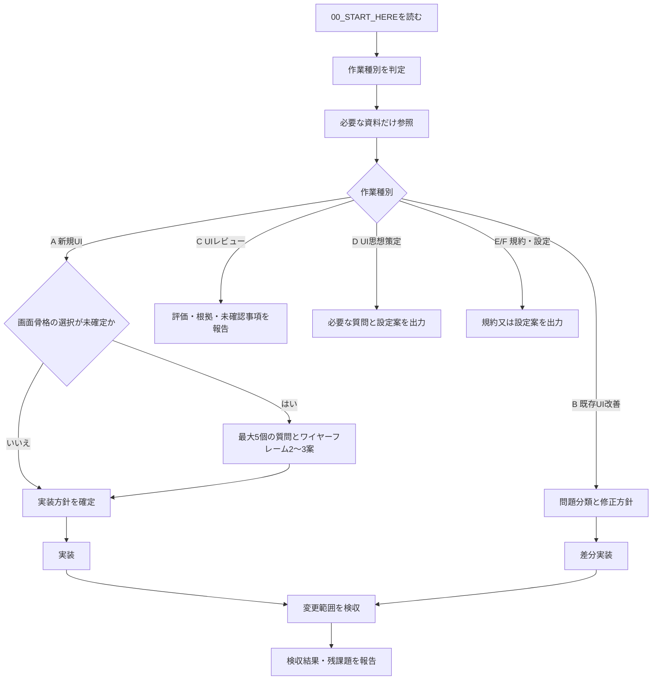

# 00_START_HERE: UI/UX Vibe Coding Agent Router

## 0. この資料群の目的

この資料群は、PC優先の業務・管理・制作支援・編集UIで、巨大ボタン、長文ボタン、過剰なカード化、理由のない配置、常用しづらい画面を避けるための運用パックである。入口文書は全手順を強制するものではなく、今回の作業に必要な資料と完了条件へ案内するルーターとして扱う。

## 1. 共通ルール

- UIに関する作業では、コード変更又は評価の前に作業種別を判定する。
- このファイルを入口にし、判定した作業種別に必要な資料だけを参照する。`reference/` 配下は根拠資料であり、最上位命令ではない。
- 質問は、画面構造、データ構造、危険操作、対象端末、既存ワークフローを左右する未確定事項に限る。低影響で後から変更可能な事項は既定値と仮定を明記して進める。
- 操作の重要度、可逆性、画面文脈に応じて Primary / Secondary / Row / Danger を分ける。画面内の strongest style と主操作は、通常は一つにする。
- 常時表示文言は、意味を損なわない範囲で短くする。説明が必要な場合は helper text、tooltip、empty state、aria-label、overflow menu を使い分ける。
- UIを実装又は変更した場合は、変更範囲に応じてアクセシビリティとUIの検収を行う。実行環境上確認できない項目は、推測で合格とせず未確認理由を報告する。

## 2. 作業種別と参照ファイル

|作業種別|判定条件|読むファイル|出力と完了条件|
|---|---|---|---|
|A. 新規UI作成|新しい画面、機能、管理画面、エディタを作る|01, 02, 必要時03, 03A, 04, 05|画面目的・主要タスク・実装方針を示す。画面骨格に複数案があり方向性が未指定ならワイヤーフレーム2〜3案を提示し、合意又は妥当な既定値で実装・検収する。|
|B. 既存UI改善|既存画面の見づらさ、使いづらさ、操作不足、密度等を改善する|01, 02, 03A, 04, 05, 必要時06, 07, `templates/ui_repair_prompt.md`|問題一覧→修正方針→差分実装→変更範囲の検収。画面骨格を変えない局所修正ではワイヤーフレームを省略できる。|
|C. UIレビューのみ|コード変更なしで評価する|02, 03A, 06, 07, `templates/review_output.md`|問題、根拠、優先度、修正案、未確認事項を報告して終了する。実装・ワイヤーフレームは行わない。|
|D. UI思想策定|ユーザーの好み・方針を設定可能な規約にする|必要時03, `templates/question_summary.md`|影響の大きい質問と既定値を示し、`ui_policy.yaml` / `ui_config.json` の案を出す。実装は別依頼とする。|
|E. コンポーネント規約作成|ボタン、テーブル等の再利用規約を作る|02, 04, 05|適用範囲、例外、design tokens、検収条件を定義する。|
|F. UI設定ファイル作成|密度・幅・表示などを後から調整可能にする|02, `schemas/ui_config.schema.json`, `project/ui_config.sample.json`|設定案をスキーマに照らして出力する。|

## 3. 質問と既定値

- 初回の質問は最大5個、モック又は診断後の追加質問は最大3個を目安にする。
- 質問には、選択肢、質問理由、未回答時の既定値を添える。
- 角丸、細かい余白、行高、ボタン高、影、微妙な色味などは、画面骨格やアクセシビリティを左右しない限り質問しない。
- 未回答時は `02_DEFAULT_UI_POLICY.md` と `project/ui_config.sample.json` を既定値の参考にし、仮定として明記する。
- 既存の明確な仕様、デザインシステム、ユーザー指示がある場合は、それらを優先する。

## 4. 既定値

- 対象: PC優先の業務・管理・編集UI。
- 表示密度: compact。ただしタッチ中心又は初見利用を主目的とする場合は再評価する。
- レイアウト: header/toolbar + main content + 必要に応じた sidebar/details panel。
- データ比較・一覧: 比較性が主目的なら card より table/list/panel を優先する。
- 補助操作: icon + tooltip + aria-label、又は overflow menu を検討する。
- 展開/折畳: 常時表示の説明ボタンより、chevron、disclosure row、短い見出しを優先する。
- 危険操作: 影響・回復可否に応じて通常導線から分離し、confirm 又は undo を用意する。
- アクセシビリティ: WCAG 2.2 AA相当を目標にし、実際に確認した範囲を区別して報告する。

## 5. 実行フロー

## 6. 完了報告

完了時は、1. 実装又は評価した対象、2. 参照した規約、3. 主要な判断と仮定、4. 実行した検収と結果、5. 未確認事項又は残課題を短く報告する。ユーザーの依頼範囲外の提案を連続して行わない。
